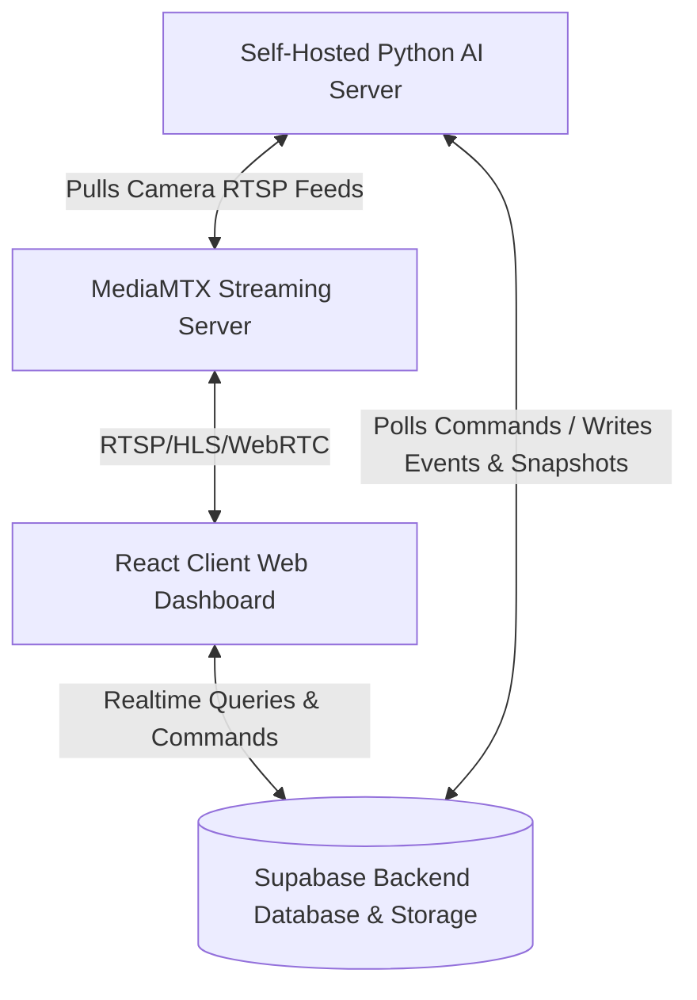

# Real Star Security Systems e-Guarding System: Project Documentation

This document outlines the architecture, database layout, core functionalities, and advanced alert/detection capabilities of the e-Guarding surveillance platform.

---

## 1. System Architecture Overview

The platform is built as an end-to-end, high-performance, real-time AI security monitoring system. It coordinates three major components:

1. **Client Dashboard (React, Vite, Tailwind CSS, TypeScript)**:
   - Provides administrative settings, real-time live monitoring of feeds, alert rule configuration, live event logs, and training management.
2. **Database & Storage Backend (Supabase)**:
   - Houses state metadata for cameras, alerts, AI models, and real-time events.
   - Stores raw snapshot images for triggered security alarms and training datasets (.zip weights) in Storage buckets.
3. **Streaming Relay (MediaMTX)**:
   - Manages and relays RTSP streams from network cameras into low-latency WebRTC/HLS feeds accessible in modern web browsers.
4. **Autonomous AI Inference Engine (Python, OpenCV, Ultralytics YOLOv8)**:
   - Connects directly to MediaMTX feeds, running real-time frame analysis.
   - Compares detections against customized user-defined rules and posts security event logs directly into the Supabase database.
   - Runs a background training daemon to automate dataset processing and model retraining.

---

## 2. Security Infrastructure & Operations Capabilities

### A. Camera & Node Management
- **Centralized Registry**: Cameras are tracked via Supabase with IP address, credentials (RTSP authentication), custom resolutions, and current operational status.
- **AI Server Node Linking**: Allows security companies to assign cameras to specific edge server instances, spreading the CPU/GPU workload.
- **Model Assignment**: Dynamically bind specific AI models (e.g., license plate recognition, face detection, weapon threat detection) to individual camera feeds.
- **Bulk Operations**: Bulk selection and deletion capabilities across cameras, models, and servers to allow quick decommissioning and reconfiguration.

### B. Live Monitoring & Zone Controls
- **Multi-Grid Surveillance View**: Flexible layout grids allowing operators to view multiple live camera feeds concurrently.
- **Intrusions & Polygons (Zones)**: Operators can draw complex intrusion polygons, tripwires, and restricted boundaries directly on top of the camera viewport canvas.
- **Zone Filtering**: Alert rules can be set to ignore standard object detections *unless* they physically intersect or cross into the drawn zones.

---

## 3. Advanced AI Detection Capabilities

Security operators can activate whitelists or blacklists of objects and behaviors. Below are the pre-configured categories supported by the platform:

| Category | Objects & Detections | Description & Specific Actions |
| :--- | :--- | :--- |
| **People & Behaviour** | `person`, `loitering_detected`, `crowd_alert`, `fight_detected`, `fall_detected` | Triggers on human entry, loitering beyond a customized dwell duration, crowd formations, physical aggression, or slip-and-fall incidents. |
| **Threats** | `weapon`, `gun`, `knife`, `fire`, `smoke` | Triggers immediate high-priority alarm logs when handguns, knives, open flames, or rising smoke are identified. |
| **Vehicles** | `car`, `truck`, `motorcycle`, `bicycle`, `bus`, `illegal_parking` | Logs all vehicles. Alerts on illegal parking if a vehicle remains stationary in a marked zone longer than the configured limit. |
| **Compliance & PPE** | `NO-Hardhat`, `NO-Safety Vest`, `NO-Mask`, `NO-Gloves`, `Hardhat` | Automated inspection of construction/industrial sites. Triggers warnings if safety gear is missing on site. |
| **Environmental** | `camera_tamper`, `license_plate` | Flags if a camera lens is blocked, sprayed, or offline. Extracts text from vehicle plates and logs them with date/time stamps. |

---

## 4. Alerts, Rules, and Notifications Engine

The alert engine is highly customizable to minimize false positives while guaranteeing critical alerts reach guards immediately:

### A. Core Rule Mechanics
- **Mode Selection**: 
  - **Whitelist**: Trigger alarms only if the detected object is selected (e.g., alert *only* on people and cars).
  - **Blacklist**: Trigger on all detections *except* the selected objects.
- **Confidence Thresholds**: Adjust sliders (10% to 90%) to set sensitivity. Higher confidence reduces false triggers caused by shadows, animals, or compression noise.
- **Schedules**: Schedule rules to be active during specific hours (e.g., lock downs from `20:00` to `06:00`) and days of the week. Supports overnight scheduling transitions.

### B. Smart Behavioral Configurations
- **Loitering Detection**: Custom dwell time limit (5 seconds to 5 minutes) and cooldown timer between alerts.
- **Crowd Thresholds**: Configurable count limits (e.g. alert if 5+ people group together) with customizable cooldowns.
- **Uniform & Dress Code Compliance**: Whitelist or blacklist required colors on specific body regions (Top, Bottom, Full body) with adjustable percentage coverage. Useful for verifying security guards are in uniform.
- **PPE Enforcement**: Toggle specific items (hard hats, vests) that are mandatory in active workspaces.

### C. Alert Gateways & Notifications
- **Real-Time Web Alerts**: Slide-in notifications showing the camera name, detection type, confidence score, and a direct link to the snapshot image.
- **Email Gateway (SMTP)**: Integrates with SMTP hosts to send rich email alerts to security team distribution groups.
- **SMS Gateway (Twilio)**: Sends instant SMS text alerts for critical threat detections (e.g., weapons, smoke, active intrusions).
- **Audio Alarms**: Toggle optional sound queues on the operator's dashboard when new security breaches occur.

---

## 5. Security Company Administrative Features

- **Database Backups**: Direct client-side SQL generator exporting all schema tables, policies, and row-level structures to a single secure file for rapid restoration.
- **Event Audit Logs**: Complete history of all events, which can be selected, batch-acknowledged, or exported to CSV and JSON formats for external reporting.
- **Autonomous Training Pipeline**: Retrain models directly from the admin dashboard by uploading datasets, monitoring epoch logs in real-time, and deploying the new weights (.pt files) instantly.

---

## 6. AI Model Operations & Retraining (Fine-Tuning) Pipeline

The platform is designed to adapt to new security requirements by letting administrators manage active weights, upload custom models, and run automated retraining jobs.

### A. Pre-trained AI Models Directory
Out of the box, the following neural networks and heuristics are built-in:
* **Person, Pose, & Behavior**: YOLOv8 (Nano/Small/Medium/X-Large) optimized for high accuracy or low CPU usage, Loitering detector (with dwell window parameters), Crowd counter, and Pose-estimation Fall detector.
* **Threat & PPE Compliance**: Weapon classifier (firearms, knives), Fire/Smoke segmentation model, and PPE violation detector (validates hard hats and safety vests).
* **Vehicles & Logistics**: License Plate Recognition (LPR) using PaddleOCR text extraction, illegal parking time tracking, and speed estimations.
* **Environmental & Heuristics**: Camera tamper alerts (detects view blockage/sprayed lenses) and dress code color classifiers (HSV region coverage check).

### B. Manually Uploading Custom Models
When you train a model externally or purchase custom weights (YOLO `.pt` or `.onnx` files), you can register it:
1. Navigate to **AI Model Management** and click **Add Model**.
2. Fill in the metadata (Name, description, categories, version, and hardware target).
3. Use the **Upload Model File** field to select your local `.pt`/`.onnx` file.
4. The system uploads the file into the Supabase Storage bucket (`ai-models`) and creates a record. 
5. The model is immediately available for selection in **Camera Management** assignments.

### C. End-to-End Autonomous Fine-Tuning (Retraining)
If a model needs to learn new object classes or improve accuracy on site-specific lighting, operators can trigger retraining from the **AI Model Management** tab:
1. **Upload Dataset**: Zip and upload your dataset containing images and `data.yaml` config (YOLO formatting).
2. **Configure Parameters**: Set the epochs (e.g. 100 epochs), batch size (e.g. 16), and learning rate.
3. **Select Server Node**: Pick an online GPU/CPU AI server node to run the heavy computing.
4. **Trigger Training**: The dashboard sends a `pending` training command to the Supabase database.
5. **Autonomous Processing**: 
   - The daemon thread on the target AI server picks up the job.
   - It extracts the ZIP, parses images/annotations, and launches **Ultralytics YOLO** fine-tuning.
   - Training metrics (progress percentage, current epoch, loss values, logs) are posted back to the database every epoch to show real-time progress on the dashboard.
6. **Deployment**: Once training succeeds, the server uploads the resulting `.pt` weights back to Supabase and registers a new active model record, ready for deployment to any security camera.
